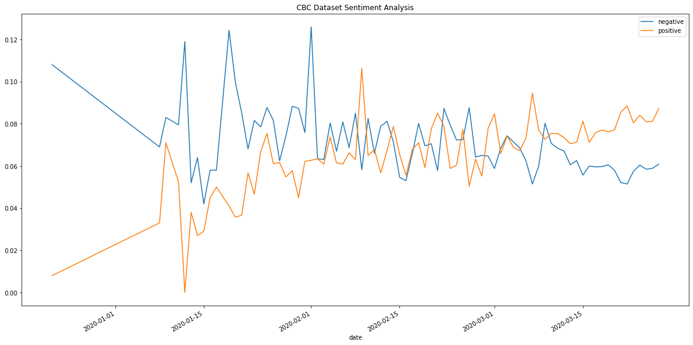
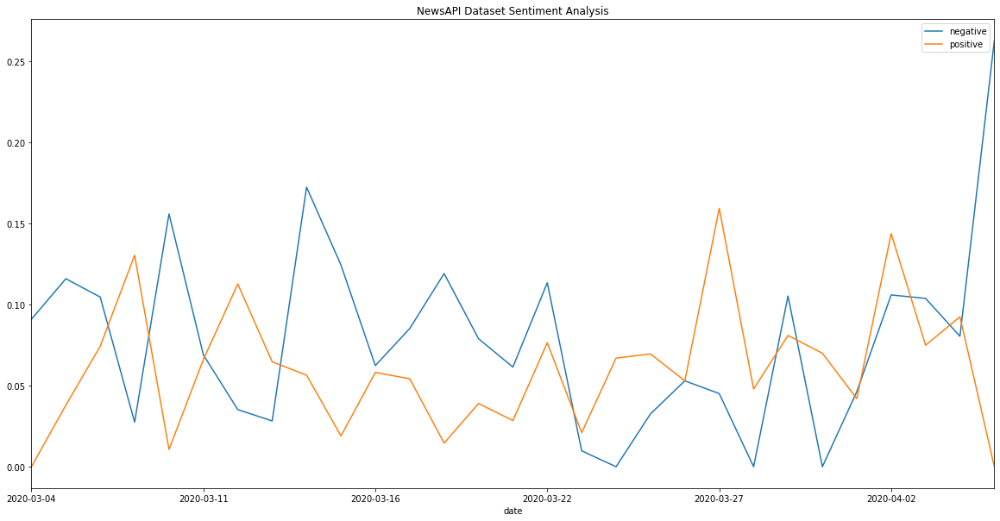
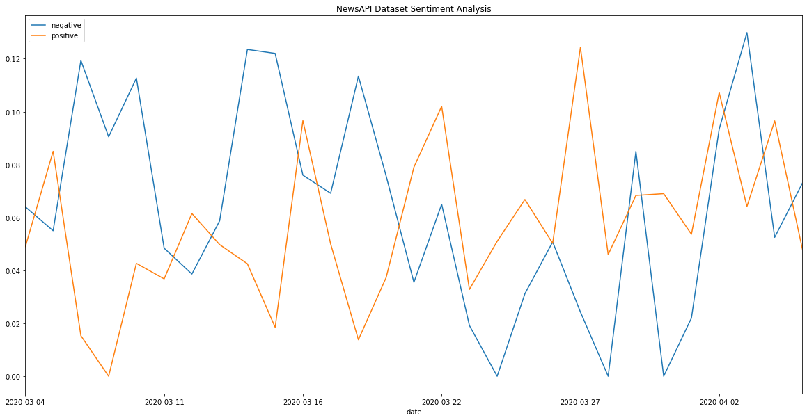

# COVID19-News-Analysis
Run sentiment analysis over dataset of news articles related to COVID19 and plot the results over time.
Using the first dataset we can see a downward trend of negative sentiment over time and an upward trend of positive sentiment over time.
Both of these results are dependent on the accuracy of the sentiment analyzer being used which is VADER for this project (https://github.com/cjhutto/vaderSentiment).

This is the generated graph using pandas plot function:

The next stage will be to use PySpark to do a similar sentiment analysis using NewsAPI for a broader dataset.
This is the result of plotting the sentiment analysis over the generated summary of the articles:

This is the result of plotting the sentiment analysis over the beginning 250 characters of the article which is all that is returned by the API:

